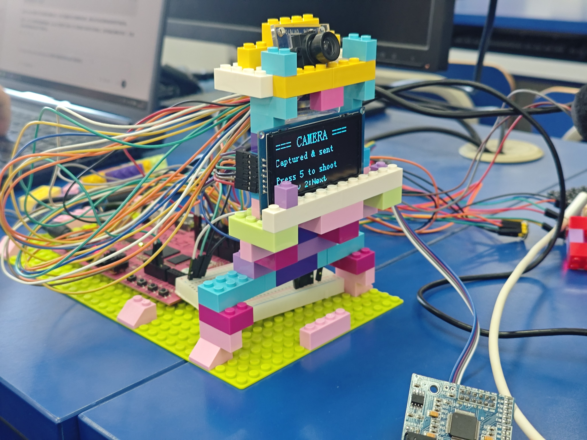
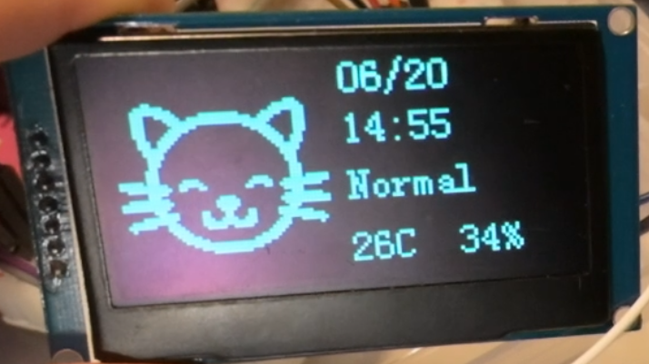

<h1 align="center">PynqPet</h1>

## 硬件清单

- Pynq-Z1
- ESP32-C3-SuperMini
- SSD1309
- UNR3/Meg2560 兼容震动马达
- 4*4 键盘
- OV7670
- DS3231RTC
- DHT11
- XFS5152
- INMP441

## 仓库结构

- `backendWrapper`: 服务端
- `vivado_files`: 硬件工程
- `vitis_files`: 客户端

## 声明

本项目基于 [Open-LLM-Vtuber](https://github.com/Open-LLM-VTuber/Open-LLM-VTuber) 二次开发，修改内容包括：
- `Open-LLM-VTuber/src/open_llm_vtuber/tts/siliconflow_tts.py`: 注释[第30-66行](https://github.com/Open-LLM-VTuber/Open-LLM-VTuber/blob/main/src/open_llm_vtuber/tts/siliconflow_tts.py#L30)，在结尾添加`return ""`
- `Open-LLM-VTuber/prompts/utils/`: 新增[pynq_command_prompt.txt](attachments/pynq_command_prompt.txt)
- `backendWrapper/`: 新增的目录

修改的部分同样遵循原[LICENSE](LICENSE)

## Third-Party Licenses

### Live2D Sample Models Notice

This project includes Live2D sample models provided by Live2D Inc. These assets are licensed separately under the Live2D Free Material License Agreement and the Terms of Use for Live2D Cubism Sample Data. They are not covered by the MIT license of this project.

This content uses sample data owned and copyrighted by Live2D Inc. The sample data are utilized in accordance with the terms and conditions set by Live2D Inc. (See [Live2D Free Material License Agreement](https://www.live2d.jp/en/terms/live2d-free-material-license-agreement/) and [Terms of Use](https://www.live2d.com/eula/live2d-sample-model-terms_en.html)).

Note: For commercial use, especially by medium or large-scale enterprises, the use of these Live2D sample models may be subject to additional licensing requirements. If you plan to use this project commercially, please ensure that you have the appropriate permissions from Live2D Inc., or use versions of the project without these models.
